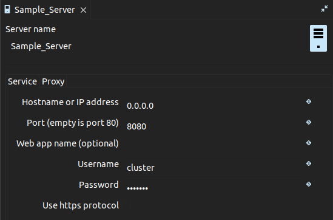
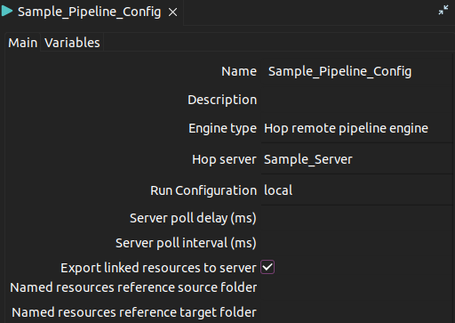
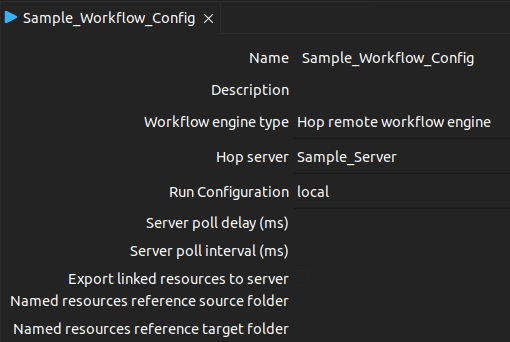
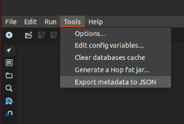
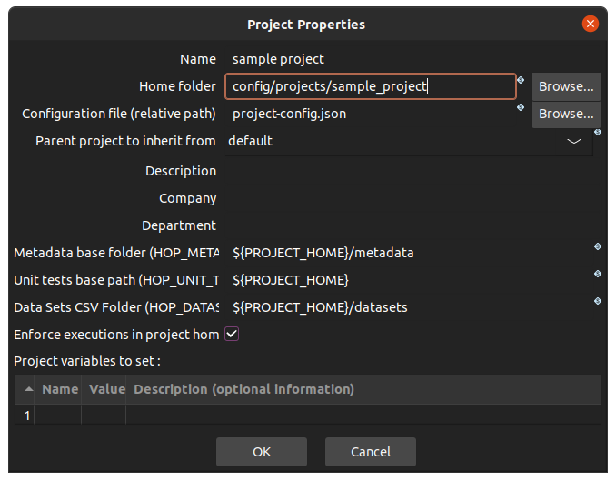

[](https://app.travis-ci.com/damavis/airflow-hop-plugin)
[](https://codecov.io/gh/damavis/airflow-hop-plugin)
[](https://pypi.org/project/airflow-hop-plugin/)
[](https://pypi.org/project/airflow-hop-plugin/)

# Hop Airflow plugin

This is an Apache Hop plugin for Apache Airflow in order to orchestrate Apache Hop pipelines and workflows from Airflow.

## Requirements

Before setting up the plugin you must have completely set up your Hop environment:

- Configured Hop Server
- Configured remote pipeline configuration
- Configured remote workflow configuration

To do so, go to the metadata window in Hop UI by pressing Ctrl+Shift+M or click the  icon.



Double click `Hop server` to create a new configuration.



Double click `Pipeline Run Configuration` to create a new configuration.



Double click `Workflow Run Configuration` to create a new configuration.

## Set up guide

The following content will be a "how to set up the plugin" guide plus some requirements and
restraints when it comes to its usage.

### 1. Generate metadata.json

For the correct configuration of this plugin a file containing all Hop's metadata must be created
inside each project directory. This can be done by exporting it from Hop UI.

Please note that this process must be repeated each time the metadata of a project is modified.



### 2. Install the plugin

The first step in order to get this plugin working is to install the package using the following
command:

```
pip install airflow-hop-plugin
```

### 3. Hop Directory Structure

Due to some technical limitations it's really important for the Hop home directory to have the
following structure.

```
hop # This is the hop home directory
├── ...
├── config
│   ├── hop-config.json
│   ├── example_environment.json # This is where you should save your environment files
│   ├── metadata
│   │   └── ...
│   └── projects
│       ├── ...
│       └── example_project # This is how your project's directory should look
│           ├── metadata.json
│           ├── metadata
│           │   └── ...
│           ├── example_directory
│           │   └── example_workflow.hwl
│           └── example_pipeline.hpl
├── ...
```

Moreover, please remember to save all projects inside the "projects" directory and set a path
relative to the hop home directory when configuring them like shown in the following picture:



### 4. Create an Airflow Connection
To correctly use the operators you must create a new
[Airflow connection](https://airflow.apache.org/docs/apache-airflow/stable/howto/connection.html).
There are multiple ways to do so and whichever you want can be used, but it should have these
values for the following attributes:

- Connection ID: 'hop_default'
- Connection Type: 'http'
- Login: apache_hop_username
- Password: apache_hop_password
- Host: apache_hop_server
- Port: apache_hop_port
- Extra: "hop_home": "/path/to/hop-home/"

 Example of a new Airflow connection using Airflow's CLI:

```
airflow connections add 'hop_default' \
    --conn-json '{
        "conn_type": "http",
        "login": "cluster",
        "password": "cluster",
        "host": "0.0.0.0",
        "port": 8080,
        "schema": "",
        "extra": {
            "hop_home": "/home/user/hop"
        }
    }'
```

### 5. Creating a DAG

Here's an example of a DAG:

```python
from airflow_hop.operators import HopPipelineOperator
from airflow_hop.operators import HopWorkflowOperator

# ... #

with DAG('sample_dag', start_date=datetime(2022,7,26),
        schedule_interval='@daily', catchup=False) as dag:

    # Define a pipeline
    first_pipe = HopPipelineOperator(
        task_id='first_pipe',
        pipeline='pipelines/first_pipeline.hpl',
        pipe_config='remote hop server',
        project_name='default',
        log_level='Basic')

    # Define a pipeline with parameters
    second_pipe = HopPipelineOperator(
        task_id='second_pipe',
        pipeline='pipelines/second_pipeline.hpl',
        pipe_config='remote hop server',
        project_name='default',
        log_level='Basic',
        params={'DATE':'{{ ds }}'}) # Date in yyyy-mm-dd format

    # Define a workflow with parameters
    work_test = HopWorkflowOperator(
        task_id='work_test',
        workflow='workflows/workflow_example.hwf',
        project_name='default',
        log_level='Basic',
        params={'DATE':'{{ ds }}'}) # Date in yyyy-mm-dd format

    first_pipe >> second_pipe >> work_test
```

It's important to point out that both the workflow and pipeline parameters within their respective
operators must be a relative path parting from the project's directory.

## Development

### Deploy Apache Hop Server using Docker

Requeriments:

- [docker](https://docs.docker.com/engine/install/)
- [docker-compose](https://docs.docker.com/compose/install/)

If you want to use Docker to create the server you can use the following docker-compose
configuration as a template:

```yaml
services:
  apache-hop:
    image: apache/hop:latest
    ports:
      - 8080:8080
    volumes:
      - hop_path:/home/hop
    environment:
      HOP_SERVER_USER: cluster
      HOP_SERVER_PASS: cluster
      HOP_SERVER_PORT: 8080
      HOP_SERVER_HOSTNAME: 0.0.0.0
```

Once done, the Hop server can be started using docker compose.

## License

```
Copyright 2022 Aneior Studio, SL

Licensed under the Apache License, Version 2.0 (the "License");
you may not use this file except in compliance with the License.
You may obtain a copy of the License at

    http://www.apache.org/licenses/LICENSE-2.0

Unless required by applicable law or agreed to in writing, software
distributed under the License is distributed on an "AS IS" BASIS,
WITHOUT WARRANTIES OR CONDITIONS OF ANY KIND, either express or implied.
See the License for the specific language governing permissions and
limitations under the License.
```
